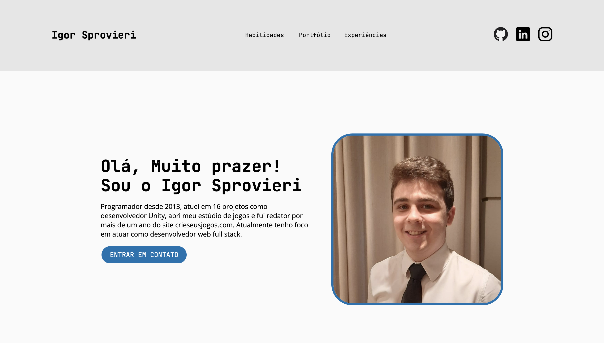

# Introduction

This project is a website builded from HTML, CSS and JS to show my portfolio and my experiences.

# Preview



## Visit

https://igorsprovieri.github.io/site-portfolio/

## Main concept applied

- Flexbox
- DOM
- Events
- API request and item listing
- CSS Media Query

## Features

- HTML
- CSS
- JS

## Instructions to run:

1. Clone the project:

```
Git Clone: https://github.com/IgorSprovieri/site-portfolio
```

2. Open the folder:

```
site-portfolio
```

3. Open the file on browser:

```
index.html
```

## Author


### _Igor Sprovieri Pereira_

Programming student since 2013, started working with Unity C# in 2020, paticipated in 16 team projects as a freelancer and his own game studio. At this time, he was a tutor on Crie Seus Jogos company, helping students and writing articles to company's website. In 2022 he decided to learn web development with HTML, CSS and JS. Actually he is fullstack programmer and he is specializing in react.js, node.js, docker, mongoose, postgres and sequelize.
